## About
This add-on is for simple creation of astronomical objects. Generate planets, moons, stars, galaxies and more!

## Installation

Download `Planets and Space objects generator.zip` and simply install it in Blender User interface (Edit -> Preferences -> Addon -> Install -> Select downloaded Zip file). Or alternatively extract folder `Planets and Space objects generator` from downloaded zip and move it directly into folder for Blender scripts/addons.

## Usage
### Adding object
You can add object simply by seslectit it id Add menu (PaSOG submenu) or simply by selecting specific object after pressing Shift + A.

    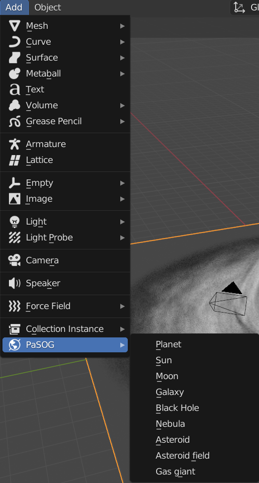

    

### Modify object
After selecting object, many object properties can be modify in operator panel, such as Level of detail, nosie, craters.

    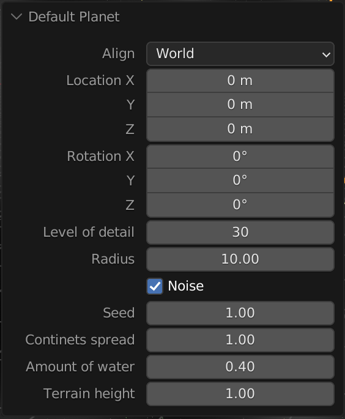

### Object surface
In side panel, object surface and in many cases even shape can be modified. You can modify surface simple objects, like planets and moons, and also shape of more complex objects like galaxies and black holes.

    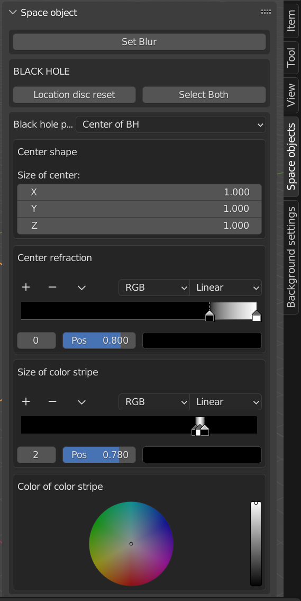

## Examples

    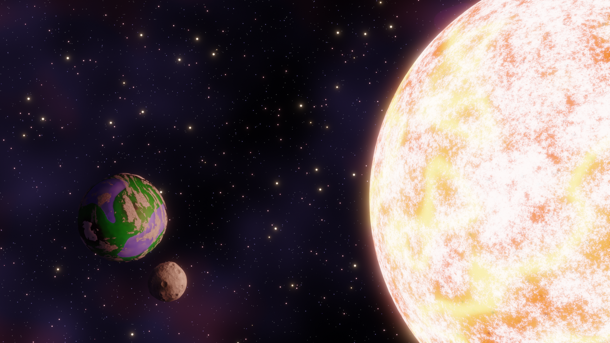
    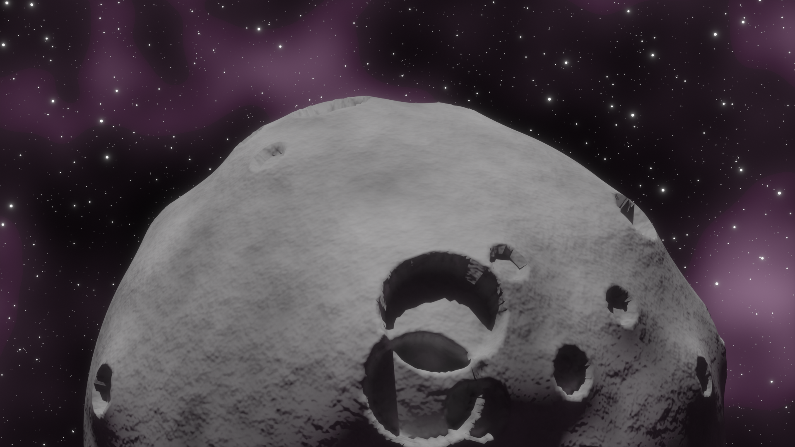
    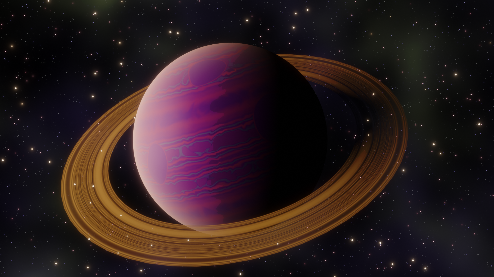
    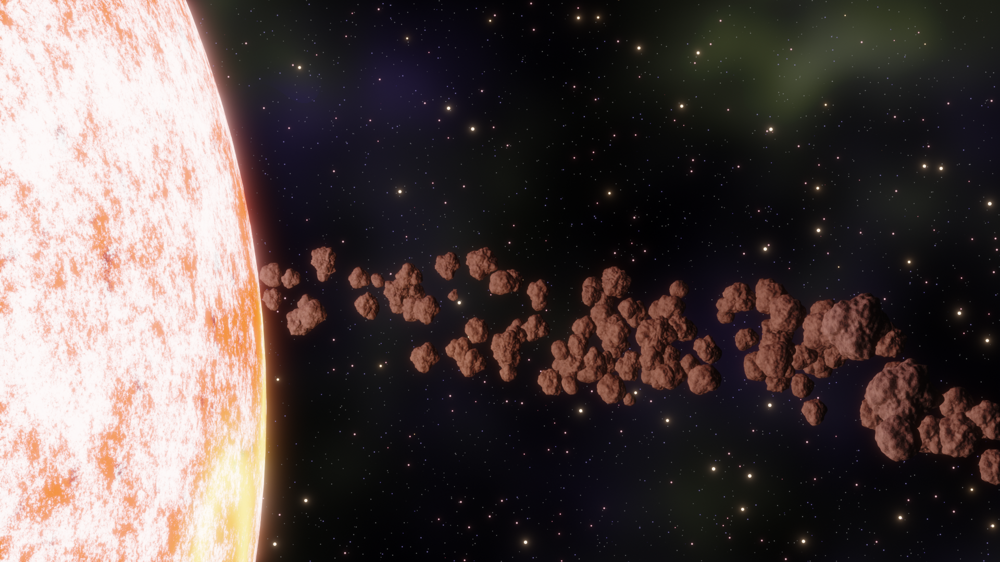
    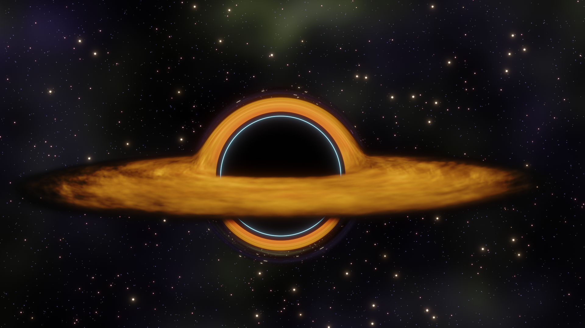
    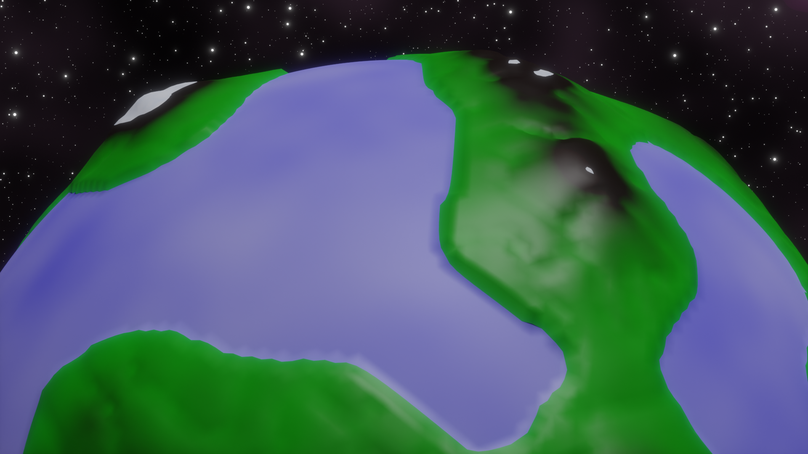
    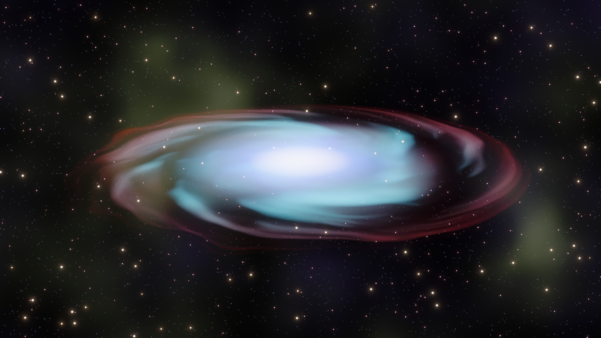
    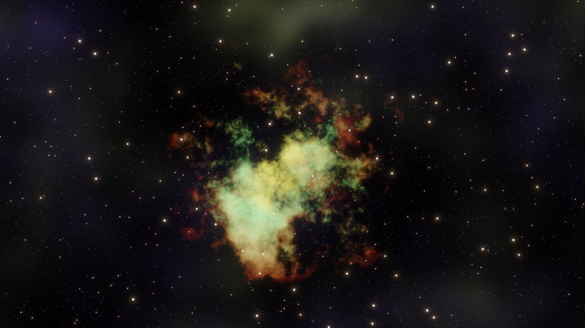

## Status
Currently supported objects:
- Planet
- Moon
- Star
- Asteroid
- Asteroid field
- Galaxy
- Gas giant
- Black Hole
- Nebula

Planned features:
- Real-life solar systems with gravity, orbits etc.
- More objects

Feel free to submit any issues or ideas!

Example video: <https://youtu.be/cb59BML3LDA>

## Author
Marek Hlávka - Bachelor Thesis

Faculty of information technology BUT

Version 1.0